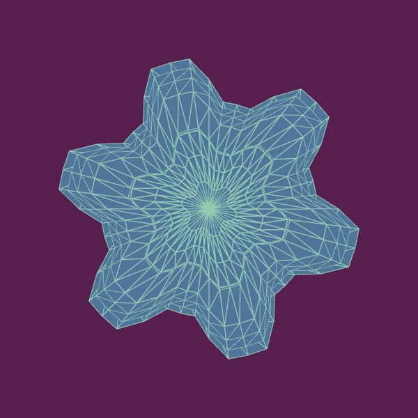

# Gear curves in p5.js

I am using the formula for the gear curve from [Wolfram Mathworld](https://mathworld.wolfram.com/GearCurve.html) and the formula for the hyperbolicTan function from [here](https://help.tc2000.com/m/69445/l/755460-hyperbolic-functions-table).

`let r =a +(1/b) * hyperbolicTan(b * sin(m * theta));`

`hyperbolicTan(theta) {`  
`let e = 2.71828;`  
`let l = pow(e, 2 * theta);`  
`return (l - 1) / (l + 1);`  
`}`

In the first row of images, I am rendering the gear curves in 2D. In the first version, I am rendering 120 curves with 10 spokes and a = 1, b = 10 (which were the parameters suggested by Mathword). In the second version, I am rendering 30 curves with 6 spokes with a and b the same. In the third version, I am rendering 10 curves with 8 spokes with random a and b. In all versions, I vary the scale of the curves.

In the second row, I have also created some random tilings by creating a grid of gears and varying the parameters. I am using Daniel Shiffman's code from the [Lissajous Challenge](https://thecodingtrain.com/challenges/116-lissajous-curve-table) to create the grid.

In the third row, I am experimenting with 3D. In the first two images, I have adapted Daniel Shiffman's code from the [3d Supershape callenge](https://thecodingtrain.com/challenges/26-3d-supershapes) to create a 3d shape. The last image draws the gear in 3d by varying z when the curves are created.

In the last row, I am starting to work on shaders.  

<!-- IMAGE-LIST:START - Do not remove or modify this section -->
<!-- prettier-ignore-start -->
<!-- markdownlint-disable -->
<table>
  <tbody>
    <tr>
      <td align="center"><a href="https://editor.p5js.org/kfahn/full/CawNObTwp">  <b>p5 sketch </b></a></td>
      <td align="center"> <b> </b></a></td>
     <td align="center"><a href="">  <b> </b></a></td>
    </tr>
     <tr>
      <td align="center"><a href="https://editor.p5js.org/kfahn/full/1iuRoYBcR">  <b>p5 sketch </b></a></td>
      <td align="center"> <b> </b></a></td>
     <td align="center"><a href="">  <b> </b></a></td>
    </tr>
    </tr>
     <tr>
      <td align="center"><a href="https://editor.p5js.org/kfahn/full/Snumj-AgS">  <b>p5 sketch </b></a></td>
      <td align="center"> <b> </b></a></td>
     <td align="center"><a href="">  <b> </b></a></td>
    </tr>
     <tr>
      <td align="center"><a href="">  <b>Shader </b></a></td>
      <td align="center"> <b> </b></a></td>
     <td align="center"><a href="">  <b> </b></a></td>
    </tr>
  </tbody>
</table>

<!-- markdownlint-restore -->
<!-- prettier-ignore-end -->

<!-- IMAGE-LIST:END -->

